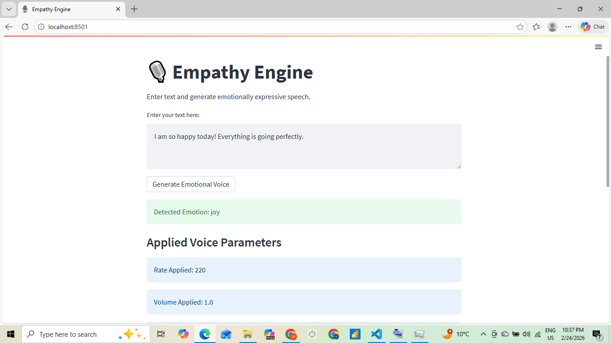
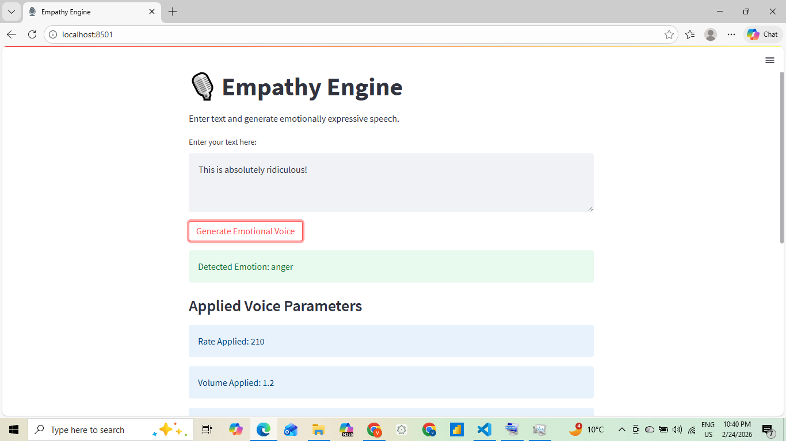
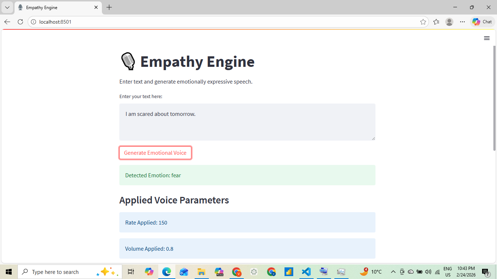
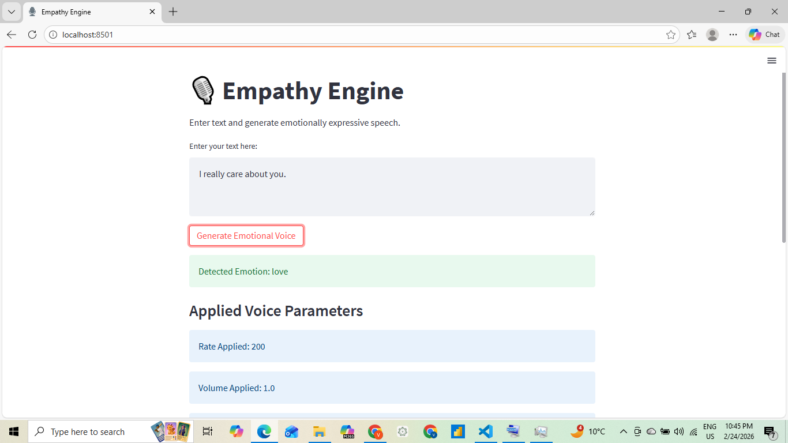
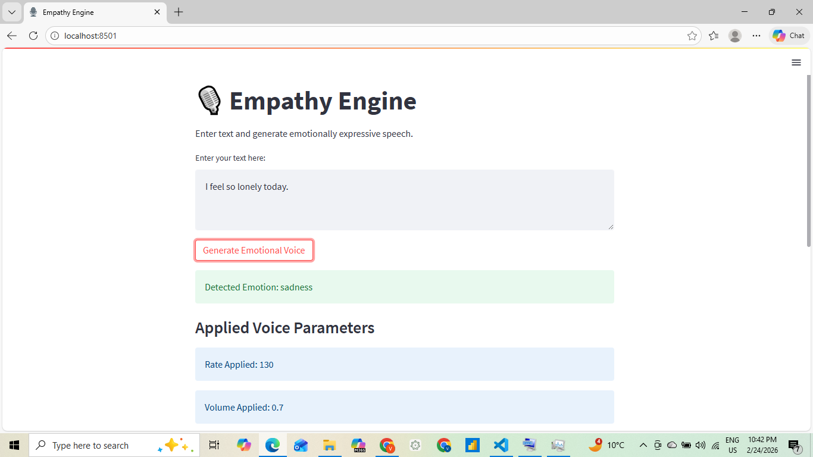
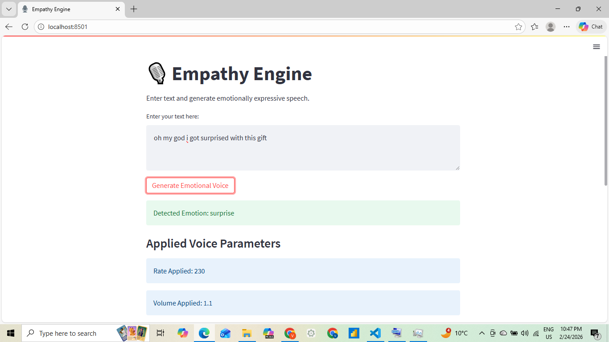

# 🎙️ Empathy Engine  
### Emotion-Aware Text-to-Speech System

Empathy Engine is an AI-powered Emotion-Aware Text-to-Speech (TTS) system that detects emotions from input text using a Transformer-based NLP model and generates emotionally expressive speech by dynamically modifying vocal parameters.

This project demonstrates:

- Emotion classification using a pre-trained DistilBERT model
- Emotion-to-voice parameter mapping
- Programmatic vocal modulation (Rate, Volume, Simulated Pitch)
- Streamlit-based interactive UI
- Categorized audio output storage

---

# 📌 Problem Statement

Traditional Text-to-Speech systems produce neutral robotic speech.  
This project enhances speech generation by detecting the emotional tone of text and modifying vocal parameters accordingly.

---

# 🧠 System Architecture

```
User Input (Text)
        ↓
Emotion Detection (DistilBERT)
        ↓
Emotion-to-Voice Mapping
        ↓
Vocal Parameter Modulation
        ↓
Audio File Generation (.wav)
        ↓
Categorized Output Storage
```

---

# 🤖 Emotion Detection Model

Model Used:
`bhadresh-savani/distilbert-base-uncased-emotion`

Framework:
HuggingFace Transformers + PyTorch

Supported Emotions:

- Joy
- Love
- Anger
- Sadness
- Fear
- Surprise

---

# 🎛 Vocal Parameter Modulation

The system modifies at least **two distinct vocal parameters**:

| Parameter | Description |
|-----------|------------|
| Rate      | Speed of speech |
| Volume    | Loudness level |
| Pitch (Simulated) | Tonal variation using rate modulation |

---

# 🎭 Emotion-to-Voice Mapping Logic

| Emotion   | Rate | Volume | Pitch Shift | Voice Behavior |
|------------|------|--------|-------------|----------------|
| Joy        | 220  | 1.0    | +20         | Fast & Energetic |
| Love       | 200  | 1.0    | +10         | Warm & Expressive |
| Anger      | 210  | 1.2    | -10         | Strong & Loud |
| Sadness    | 130  | 0.7    | -20         | Slow & Soft |
| Fear       | 150  | 0.8    | -5          | Slightly Hesitant |
| Surprise   | 230  | 1.1    | +25         | Very Fast & Excited |
| Neutral    | 170  | 1.0    | 0           | Balanced Tone |

Each detected emotion maps to a predefined configuration of voice parameters.

---

# 🖥 User Interface

Built using Streamlit.

Features:
- Text input box
- Emotion detection display
- Applied voice parameter display
- Audio playback
- Emotion-to-voice mapping table

---

# 📂 Project Structure

```
EmpathyEngine/
│
├── emotion_model.py
├── voice.py
├── streamlit_app.py
├── static/
│   ├── joy/
│   ├── anger/
│   ├── sadness/
│   ├── fear/
│   ├── love/
│   ├── surprise/
│   ├── neutral/
│
├── README.md
├── requirements.txt
```


# 🚀 Installation Guide

## 1️⃣ Clone Repository

```
git clone <your-repo-link>
cd EmpathyEngine
```

## 2️⃣ Create Virtual Environment

```
python -m venv venv
venv\Scripts\activate
```

## 3️⃣ Install Dependencies

```
pip install -r requirements.txt
```

## 4️⃣ Run Application

```
streamlit run streamlit_app.py
```

---

# 📦 Requirements

- Python 3.9+
- Streamlit
- Transformers
- PyTorch
- pyttsx3

---

# 📸 Output Screenshots


# 🎯 Example Input & Output




.png)

### Input Text:
```
I am so happy today! Everything is going perfectly.
```

### Detected Emotion:
```
Joy
```

### Applied Parameters:
- Rate: 220
- Volume: 1.0
- Pitch Shift: +20

### Generated Output:
Audio file stored in:
```
static/joy/
```

## More images



.png)



.png)



.png)



.png)



.png)

---

# ⚙️ Technical Highlights

- Transformer-based NLP classification
- Real-time voice parameter modulation
- Structured emotion mapping logic
- Dynamic audio file categorization
- Streamlit interactive frontend

---

# 🏆 Key Learnings

- Emotion detection using pre-trained NLP models
- Practical implementation of TTS systems
- Mapping AI output to real-world system parameters
- UI integration with ML backend
- Project structuring and deployment readiness

---

# 👨‍💻 Author

Developed as an AI-driven Emotion-Aware Speech Generation System.

---

